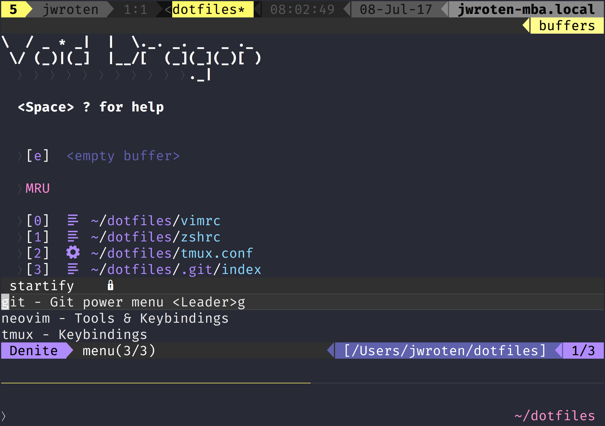

# Joe Wroten's Dotfiles

Develop using just the terminal with the very best tools. iTerm2, Tmux, NeoVim, and Zsh come together to create a solid development environment. Designed to be flexible and powerful.

Based on the [A Modern Terminal Workflow](https://wrotenwrites.com/a_modern_terminal_workflow_1/) blog series where I walk you step-by-step how [the core of these dotfiles](https://github.com/sharpshark28/modern-terminal-workflow) were written. 

## Please Note

**This is intended to set up a developers environment from the ground up.**

Running init.sh will replace your zsh profile, vim/NeoVim settings and tmux settings. _Run at your own risk._

## Install

Be sure your Xcode _and_ Xcode command line tools are installed and up to date.

1. Get This Repo `git clone git@github.com:sharpshark28/dotfiles.git ~/dotfilez`
2. Run Init `bash ~/dotfilez/init.sh`
3. Restart your terminal
4. Load iTerm2 Preferences from `~/dotfiles` directory

Get started in your project dir with `nvim` and enjoy!
